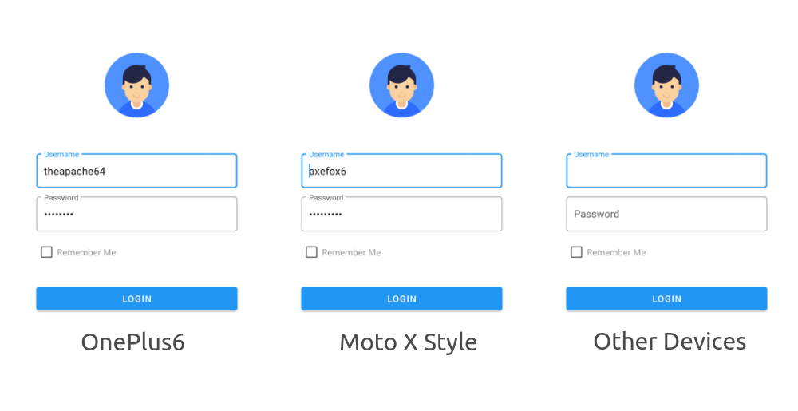

# ProMock

Per device mock data, redefined.

### Installation

```groovy
implementation 'com.theah64.promock:promock:1.0.0'
```

### Usage

In your `Application` class

```kotlin

class App : Application() {

    override fun onCreate() {
        super.onCreate()

        // Creating 2 devices
        // 1 = A OnePlus6
        // 2 = A MotoXStyle
        // The special string is device's `Settings.Secure.ANDROID_ID`
        val device1 = ProMockDevice("OnePlus6", "8ab6d7ccc06a1703")
        val device2 = ProMockDevice("MotoXStyle", "3f6af0e1ef0d3722")

        // Creating values for each devices
        val usernameDev1 = ProMockKeyValue(R.id.username, "theapache64")
        val passwordDev1 = ProMockKeyValue(R.id.password, "pass1234")

        val usernameDev2 = ProMockKeyValue(R.id.username, "axefox6")
        val passwordDev2 = ProMockKeyValue(R.id.password, "admin1234")


        // Attaching those values to corresponding device
        device1.addKeyValue(usernameDev1)
        device1.addKeyValue(passwordDev1)
        
        device2.addKeyValue(usernameDev2)
        device2.addKeyValue(passwordDev2)


        // Finally, Integrating
        ProMock.init(this, device1, device2)
    }
}

```

In your other classes, such as `Activity`, `Fragment`, `Adapters`, etc.

```kotlin
 etUsername.setText(ProMock.getString(R.id.username))
 etPassword.setText(ProMock.getString(R.id.password))
```

### Output



### FAQ

**How to get my devices' unique id ?**

```kotlin
Log.d("ProMock","Current device ID is ${ProMock.getDeviceId(this)}")
```

and copy from `Logcat`

### TODO

- Custom unique ID support
- Other device data support
